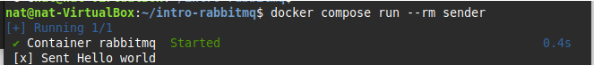

# Introducción a RabbitMQ

Este proyecto es una introducción al uso de RabbitMQ, un sistema de mensajería que implementa el protocolo AMQP (Advanced Message Queuing Protocol).

## ¿Qué se hizo?

En este proyecto, se configuraron tres servicios principales utilizando Docker Compose:

1. **RabbitMQ**: El servidor de mensajería que actúa como intermediario para el envío y recepción de mensajes.
2. **Sender**: Un servicio que envía mensajes al servidor RabbitMQ.
3. **Receiver**: Un servicio que recibe y procesa los mensajes desde RabbitMQ.

## Tutorial usado

Este proyecto se basó en un tutorial de JavaScript que utiliza Node.js para trabajar con RabbitMQ.

# Flujos del tutorial

## Sending (Envío de mensajes)

En esta imagen el script send.js se conecta a RabbitMQ y envía un mensaje:

## Receiving (Recepción de mensajes)

En esta imagen el script receive.js se conecta a RabbitMQ y espera mensajes de la cola hello:

## Putting all together (Integración de todo)

Finalemnte se levantan todos los servicios con Docker Compose:

Al final de la ejecución ya se evidnecían los logs de ambos servicios

